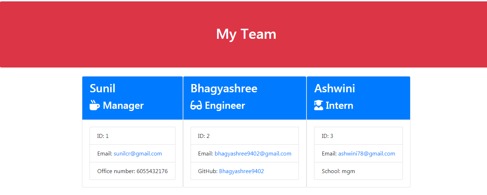

# Template Engine - Employee Summary

## Description
To build a software engineering team generator command line application. The application will prompt the user for information about the team manager and then information about the team members.
challenge is to build a Node CLI that takes in information about employees and generates an HTML webpage that displays summaries for each person. Since testing is a key piece in making code maintainable, you will also be ensuring that all unit tests pass.

## Table of Contents
- [Installation](#installation)
- [Usage](#usage)
- [License](#license)
- [Contribution](#contribution)
- [Tests](#tests)
- [Questions](#questions)

## Installation
npm install 

## Usage
 To generate a webpage that displays my team's basic info to have quick access to emails and GitHub profiles

## License
none

## Contribution
Single Contributor

## Tests
npm run test, node app.js

## Questions
#### Link to GitHub page: [GitHub_Link](https://github.com/Bhagyashree9402)

#### Email: bhagyashree9402@gmail.com

## Video: [link](https://drive.google.com/file/d/1XRH9y-9qXPR1voR6MBadvgXJA9sz2ByM/view)

## Demo Screenshot:
